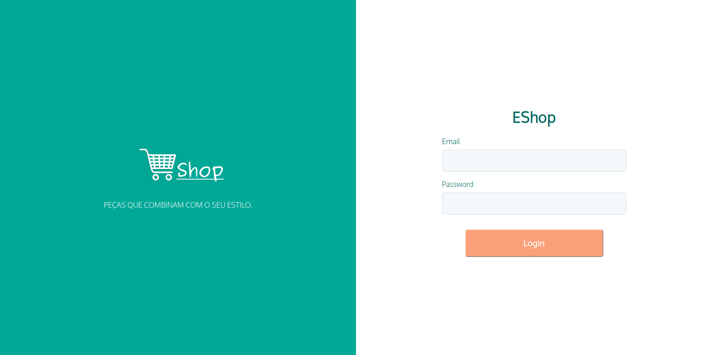

# Eshop Frontend
In this project was implemented an ecommerce with shopping cart and payment integration (Paypal). 
I used the Smart Button provided by paypal, but the request to paypal API is made in the ecommerce-backend.

Link  to API: (https://github.com/carvalho-rafael/ecommerce-backend).

## Tecnologies
- React
- Typescript
- Styled-components

## Screenshots

